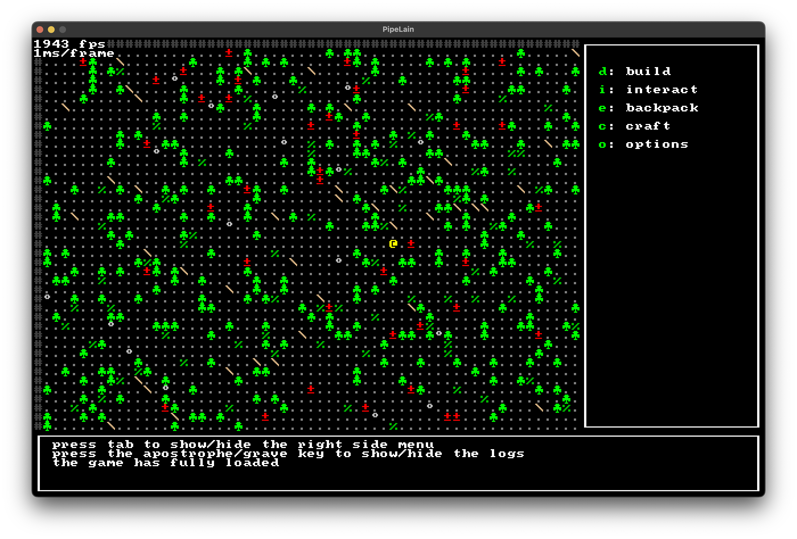

# `pipelain`

A game about optimizing pipelines and workflows to unlock new products and byproducts.



## Running or Installing

Currently, this game is not available anywhere. To play you need to download the source and compile it. The code below assumes you have `cargo` and `git` installed.

```shell
git clone https://github.com/minsk-dev/pipelain-core pipelain
cd pipelain
cargo install
```

## Configuring

Currently, you can change very few things. All you can change is performance/GUI related properties like below.

```KDL
performance show-fps=true fps-cap=144
```

Write a file like the above named `config.kdl` and place it on the same directory as your game binary. Defaults to `~/.cargo/bin` on Unix systems.

## License

The [LICENSE](LICENSE) is the BSD-3-Clause license. 